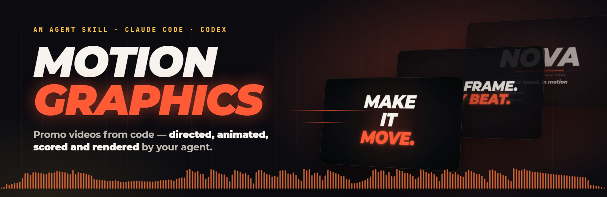
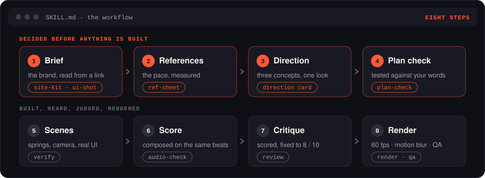
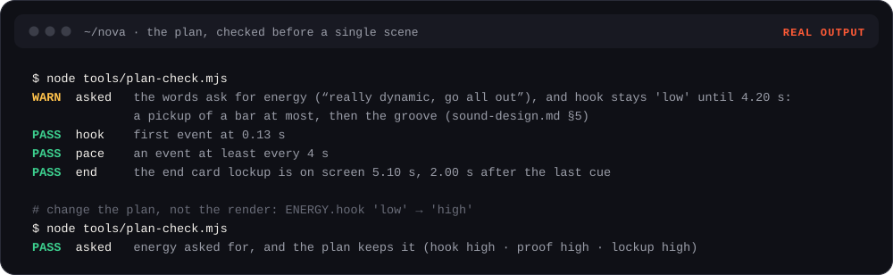
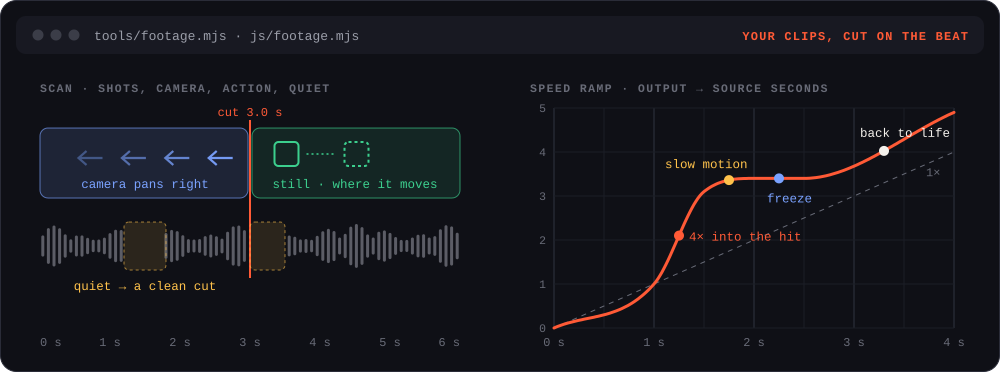
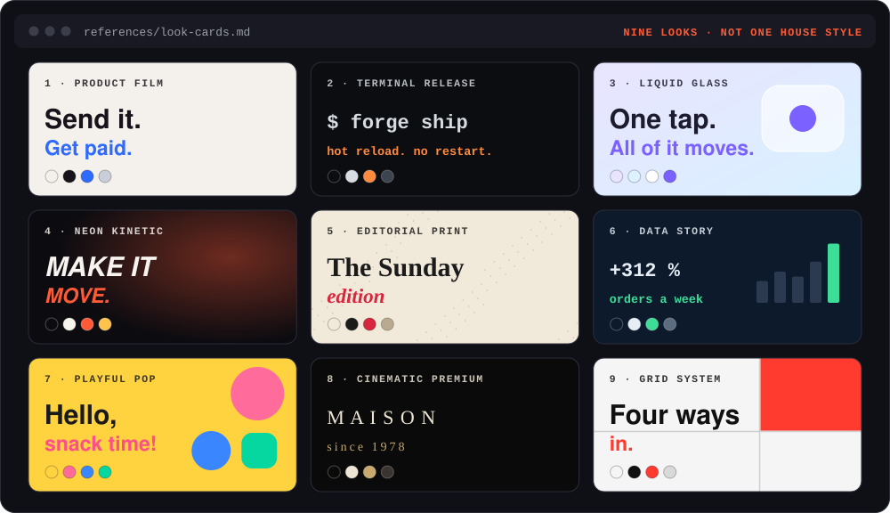

<div align="center">



[](skills/motion-graphics/SKILL.md)
[](#install)
[](#requirements)
[](LICENSE)


<sub>Rendered by the skill, score included · <a href="media/demo.mp4">MP4 with sound</a></sub>

</div>

<br>

Give your agent a link, a repo, screenshots or your own clips, and ask for a video. It directs the film, animates it
in code, composes the music and renders the MP4.

## What it does

- **Directs before it builds** — three concepts, one of nine looks, a plan checked against your words.
- **Reads your brand from a link** — the real interface, logo, colours, fonts and prices.
- **Animates in code** — springs, a moving camera, sub-frame motion blur, 60 fps.
- **Cuts your footage on the beat** — speed ramps, whips, freezes, captions.
- **Scores every video** — an original soundtrack; no two videos sound alike.
- **Critiques itself** — fixes the worst until every score is 8 / 10, then checks every frame.

## How it works



One file holds the film: the scenes, how hard each one hits, and every hit as a named cue on the beat grid. The
picture and the score are both built from it — the drop lands on the brand, the silence before the logo is real.



## The plan is checked first



Your words set the energy. A plan that breaks them is caught in seconds, before a single frame is rendered.

## Your footage



The scan finds the cuts, the camera's direction, the action and the quiet between phrases. The edit lands on the beat.

## Nine looks



## Sound


A score composed for each video from a built-in synth, checked by eye against its cues, fingerprinted against your
earlier videos.

## Install

```bash
npx skills add Mort1d/motion-graphics-skills
```

As a Claude Code plugin:

```
/plugin marketplace add Mort1d/motion-graphics-skills
/plugin install motion-graphics@motion-graphics-skills
```

Works with Claude Code, Codex, Cursor, Gemini CLI, OpenCode and any agent that supports
[Agent Skills](https://agentskills.io).

## Use

> Here's our site — a dynamic 20-second promo for X. Go all out.

> A 6-second logo sting for my channel, logo attached. Heavy, cinematic.

> Clips from our trip, attached — a vertical reel with wow transitions.

You get `out/<name>.mp4` (60 fps, −14 LUFS), covers, a light copy for messengers and a project that re-renders with
one command. Facts come only from you or your site's public pages; references are studied, never copied.

## Requirements

Node.js 22.4+, ffmpeg, and Chrome, Edge or Chromium. No npm packages, API keys, stock footage or AI video.

## License

[MIT](LICENSE). Bundled fonts: Montserrat and JetBrains Mono, SIL Open Font License 1.1
([OFL.txt](skills/motion-graphics/assets/template/assets/fonts/OFL.txt)).
