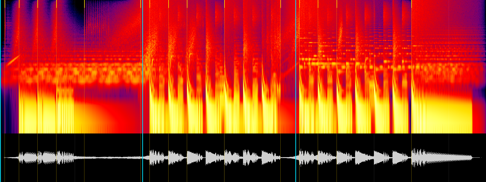

<div align="center">

# Motion Graphics Skills

**Моушн-графика уровня шоурила из кода — и свой оригинальный саундтрек у каждого ролика.**

[English](README.md) · **Русский**

[](skills/motion-graphics/SKILL.md)
[](#установка)
[](#что-нужно)
[](LICENSE)


<sub>Демо из шаблона для выдуманного бренда, отрендерено инструментами скилла · <a href="media/demo.mp4">MP4 в полном качестве</a></sub>

</div>

## Что делает

Дайте агенту что есть — ссылку на сайт, GitHub-репозиторий, приложение, скриншоты, свои видео и фото,
посты-референсы из X или Telegram или просто название — и попросите ролик.

- **Сначала режиссирует, потом строит** — читает сначала ваши слова, затем то, что вы дали, где ролик будут
  смотреть и как говорит сам бренд; взвешивает три концепции и ведёт одну от первого кадра до последнего; стартует
  от одного из девяти стилей, а не от одного на всех; пишет карточку режиссуры и проверяет план до первой сцены.
- **Энергию берёт от вас** — промо по умолчанию качает с первого такта, спокойствие — когда вы о нём просите или
  бренд в нём живёт. Музыка либо ведёт склейки, либо озвучивает каждое нажатие в интерфейсе.
- **Читает бренд по ссылке** — настоящий интерфейс поэлементно на прозрачном фоне, логотип, цвета, которые сайт
  реально рисует, шрифты, цены и контакты.
- **Изучает референсы по цифрам** — сколько кадра движется, сколько визуальных ударов в минуту, сколько из них в
  долю, где заходит дроп.
- **Рендерит настоящую моушн-графику** — HTML-сцены снимаются кадр за кадром в headless Chrome: пружинная физика,
  камера, которая следит за действием, motion blur из под-кадров, бесшовные лупы.
- **Монтирует ваши видео** — разбирает клипы (планы, самые живые секунды, куда едет камера) и режет их в долю:
  спидрампы, свипы, которые продолжают движение камеры, зум-панчи, стоп-кадры, грейды, глитчи; для записи экрана —
  камера, которая сама наезжает туда, где идёт работа.
- **Сочиняет свою музыку** — встроенный синтезатор на 80 голосов и 22 жанровые карточки, звуковой дизайн на каждой
  склейке, ваши собственные записанные звуки, если они есть, и проверка отпечатка, чтобы два ролика не звучали
  одинаково.
- **Критикует себя до рендера** — кадр на каждую долю, вид с телефона, раскадровки всех быстрых движений; семь
  оценок из 10, три худших места исправляются — и так, пока каждая оценка не станет 8 или выше.
- **Проверяет всё** — громкость и true peak, застывшее начало, одиночные мигающие кадры, текст, срезанный краем
  кадра, шов лупа, кадры, которые зависят не только от времени, недостающие глифы, остатки шаблона.

Промо · запуски · объяснялки · интро · анимация логотипа · Reels, Shorts и TikTok · ролики о путешествиях и
событиях из фото.

## Установка

```bash
npx skills add Mort1d/motion-graphics-skills
```

Как плагин Claude Code:

```
/plugin marketplace add Mort1d/motion-graphics-skills
/plugin install motion-graphics@motion-graphics-skills
```

Или скопируйте `skills/motion-graphics` в папку скиллов агента (`~/.claude/skills/` для Claude Code). Работает в
Claude Code, Codex, Cursor, Gemini CLI, OpenCode и любом агенте с поддержкой [Agent Skills](https://agentskills.io).

## Как пользоваться

Хватит обычных слов на любом языке:

> Референсы: https://x.com/…/status/… https://x.com/…/status/… https://x.com/…/status/… — сделай динамичный
> продающий ролик в моушн-графике для нашей кофейни zerno.example. Выложись по полной. Заказы — через
> @zerno_example_bot.

> Заставка на 6 секунд для моего ютуб-канала, логотип прикладываю. Мощно, кинематографично.

> Вертикальный 9:16 на 20 секунд для детской школы рисования. Ярко, весело, стильная музыка.

> https://github.com/…/… — ролик к выходу версии 2.0 нашего CLI. Прям динамично, для X.

> Видео и фото из нашей поездки в Грузию, прикладываю — вертикальный рилс с вау-переходами.

На выходе — `out/<имя>.mp4` (1080p или вертикаль, 60 fps, −14 LUFS), лёгкая версия для мессенджеров, обложки и
проект, который перерендеривается одной командой. По запросу: другие языки, версия 9:16, нарезка на 15 секунд,
таймлайн в JSON для Remotion, HyperFrames или монтажной программы.

## Что нужно

| | |
|---|---|
| Node.js | 22.4 или новее |
| ffmpeg + ffprobe | в PATH |
| Браузер | Chrome, Edge, Chromium или Brave; свой — через `CHROME_PATH` |
| ОС | Windows, macOS, Linux |

Без npm-пакетов, API-ключей, стоков и AI-видео. Сеть нужна только, чтобы прочитать ссылки, которые вы дали. В чате
без терминала агент пишет весь проект и отдаёт его с командами, которые отрендерят ролик у вас.

<details>
<summary><b>Почему каждый ролик звучит по-своему</b></summary>
<br>

Без присмотра любая модель на «побольше динамики» пишет один и тот же хаус в ля миноре. Здесь у каждого ролика
свой саунд-бриф (жанр, темп, тональность, звуковой логотип, 2–4 звука из мира бренда) и стартовая точка, которая
сдвигается по названию бренда и уходит от ваших прошлых роликов:

```bash
node tools/sound-print.mjs --suggest "Loafly" --world food --in ~/videos
```

У готового трека снимается отпечаток — где в такте бьют бочка, снейр и хэты, тембр, темп, тональность — и
сравнивается с демо и с другими роликами в папке. Проверка называет, что совпало («грув 0.87, тембр 0.84»), и агент
знает, что менять. Калибровка — на шести реальных промо, собранных на одном наборе синтов: пять хаус-подобных дают
между собой 0.74–0.96 и помечаются.



Что агент смотрит вместо прослушивания: каждый удар на своей линии, тишина перед логотипом — тёмная полоса.

</details>

<details>
<summary><b>Как тестировался</b></summary>
<br>

Три брифа от начала до конца — кофейня на русском (16:9), детская школа рисования (9:16), запуск SaaS на
английском — на Claude Sonnet, с оценкой скриптом; после каждого раунда скилл правился:

| Раунд | Пройдено проверок | Звук против шести прошлых промо (1 = тот же) |
|---|---|---|
| 1 | 41 / 42 | до 0.86: хаус-подобно, все брифы в ля миноре |
| 2 | 38 / 42 | до 0.85: два брифа на одном диско-груве 116 BPM |
| 3 | 42 / 42 | 0.34–0.66, между собой меньше 0.75 |

Четвёртый раунд — собственный промпт автора слово в слово: четыре ссылки на X, реальный бизнес, который продаёт
через Telegram-бота, «выложись по полной» — на Claude Opus: промо на 32,8 секунды и нарезка на 15, liquid drum & bass
174 BPM, не больше 0.50 против шести прошлых промо, QA пройден. Найденное (пики кодека в производных файлах, темп,
прочитанный вдвое медленнее, шрифт без ₽) исправлено и перепроверено.

</details>

<details>
<summary><b>Структура репозитория</b></summary>
<br>

```
skills/motion-graphics/
  SKILL.md           процесс, по которому идёт агент
  references/        режиссура, карточки стилей, библиотека вау-приёмов, сторителлинг и моушн, кукбук сцен,
                     футаж, саунд-дизайн, жанры, API синтезатора, пайплайн
  scripts/           site-kit, ui-shot, ref-sheet, new-project, trace-logo, palette
  assets/template/   рабочий проект: сцены, моушн-кит, экран для футажа, синтезатор, проверка плана / захват /
                     рендер / QA
.claude-plugin/      marketplace.json для Claude Code
media/               демо
evals/               тестовые промпты
```

</details>

## Ответственность

Скилл требует от агента брать факты только из брифа, с сайта или от пользователя; читать только публичные
страницы (без входа в аккаунты, защита от ботов не обходится); не показывать персональные данные; учиться у
референсов, не копируя их кадры, тексты и музыку; соблюдать правила рекламы на рынке клиента.

## Лицензия

[MIT](LICENSE). Шрифты в комплекте: Montserrat и JetBrains Mono, SIL Open Font License 1.1
([OFL.txt](skills/motion-graphics/assets/template/assets/fonts/OFL.txt)).
